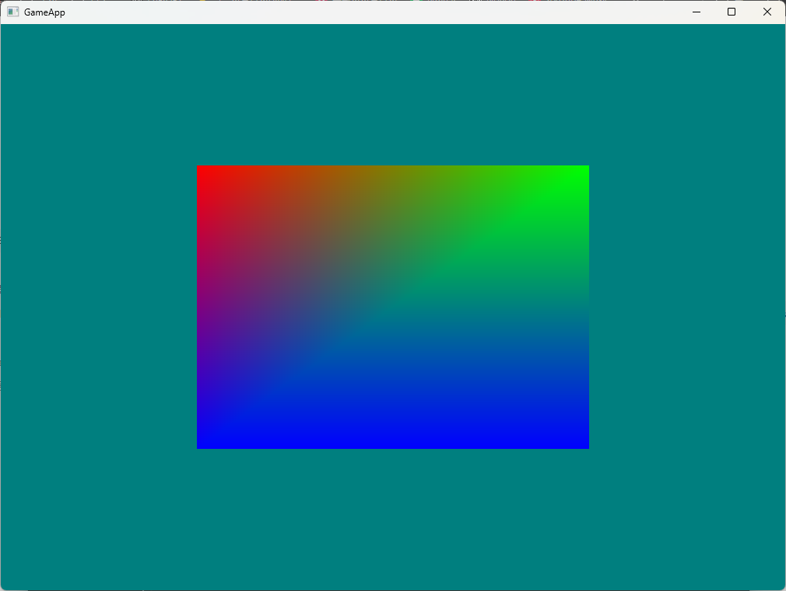
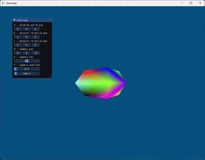
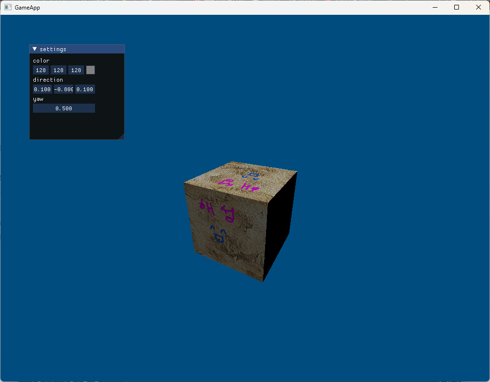
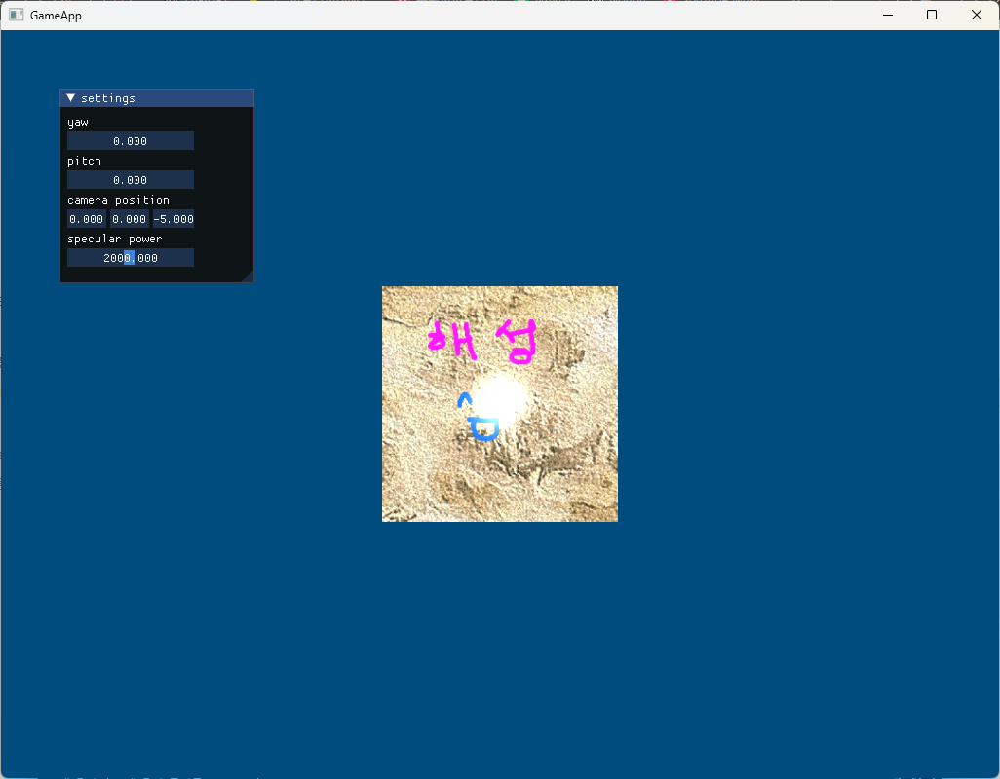
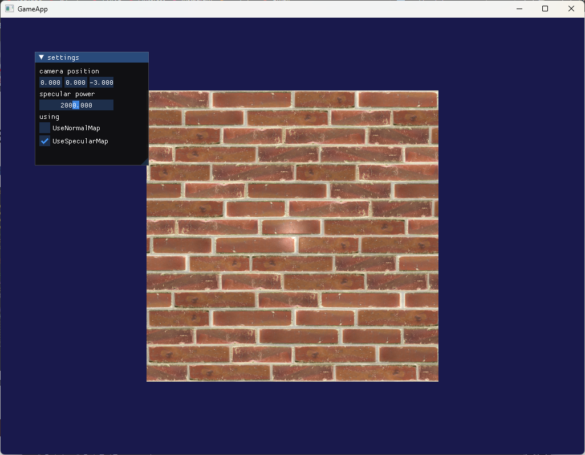
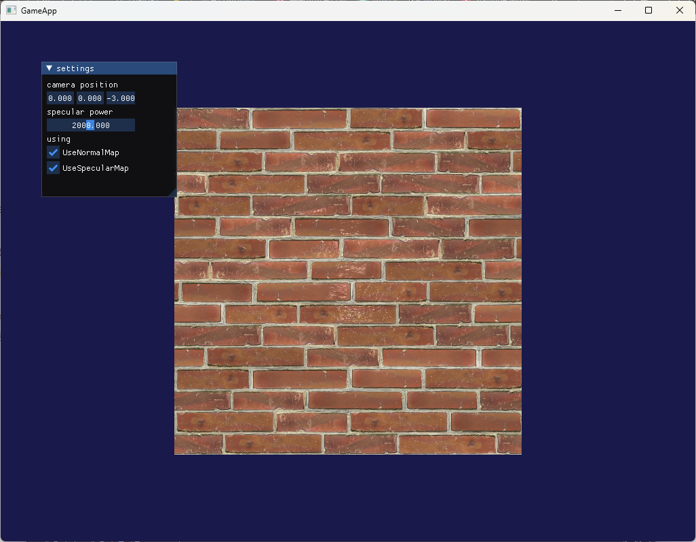
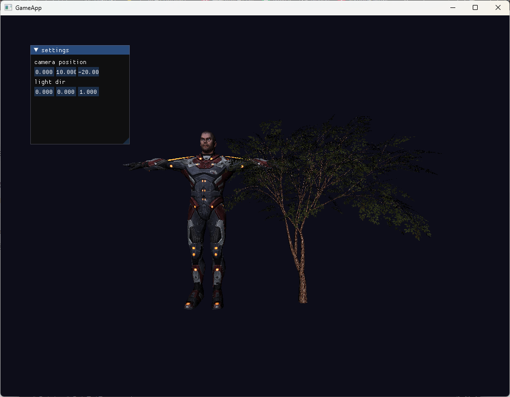
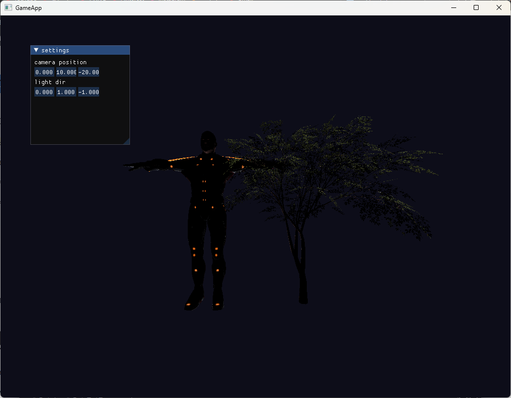
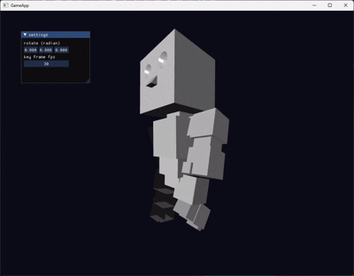
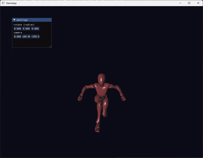

# 3DModelViewer

`3DModelViewer`는 DirectX11을 기반으로 3D 모델을 화면에 출력하고, 다양한 그래픽스 개념을 단계적으로 실습하기 위해 제작한 학습용 프로젝트입니다.

단순히 모델을 불러오는 기능만 구현한 것이 아니라, 3D 렌더링에 필요한 기본 구조를 직접 구성하며 다음과 같은 내용을 학습하는 데 초점을 두었습니다.

- Win32 API 기반 윈도우 생성 및 메시지 루프 처리
- Direct3D 11 디바이스, 스왑체인, 렌더타겟, 깊이 버퍼 초기화
- Vertex Shader / Pixel Shader 기반 렌더링 파이프라인 구성
- 정점 버퍼, 인덱스 버퍼, 상수 버퍼 관리
- Diffuse / Normal / Specular / Emissive / Opacity 텍스처 처리
- Blinn-Phong 조명 모델 구현
- Assimp 기반 FBX 모델 로드
- 노드 계층 구조를 이용한 모델 Transform 처리
- Bone, Weight, Animation Key를 이용한 스키닝 애니메이션 처리
- ImGui를 이용한 간단한 디버그 UI 구성

## 결과물

### 기본 렌더링 출력



### 렌더타겟 출력 및 좌표 변환



### Lambert 라이팅



### Blinn-Phong 라이팅



### 노멀 매핑 적용 전 / 후

| Before | After |
|---|---|
|  |  |

### FBX 모델 로드

| Default | Dark |
|---|---|
|  |  |

### 계층 구조 애니메이션



### 스키닝 애니메이션



## 주요 학습 내용

### 1. Direct3D 11 렌더링 파이프라인 구성

Direct3D 11을 사용하여 렌더링에 필요한 기본 요소를 직접 초기화했습니다.

- Device / DeviceContext 생성
- SwapChain 생성
- RenderTargetView 생성
- DepthStencilView 생성
- Viewport 설정
- Primitive Topology 설정
- Input Layout 구성
- Vertex Shader / Pixel Shader 로드 및 적용

이를 통해 GPU 렌더링이 단순히 모델을 출력하는 과정이 아니라, 여러 그래픽스 리소스와 파이프라인 상태를 조합하여 이루어진다는 점을 학습했습니다.

### 2. 셰이더 기반 렌더링

HLSL을 사용하여 Vertex Shader와 Pixel Shader를 작성했습니다.

Vertex Shader에서는 정점의 위치, 법선, 텍스처 좌표, 탄젠트, 본 인덱스, 본 가중치 등의 데이터를 처리하고, Pixel Shader에서는 조명과 텍스처를 조합하여 최종 색상을 계산했습니다.

구현한 주요 셰이딩 요소는 다음과 같습니다.

- Diffuse Lighting
- Ambient Lighting
- Specular Lighting
- Blinn-Phong Half Vector 계산
- Normal Mapping
- Specular Map
- Emissive Map
- Opacity Map

### 3. 텍스처 및 머티리얼 처리

모델의 머티리얼 정보를 기반으로 여러 종류의 텍스처를 로드하고 렌더링에 반영했습니다.

지원한 텍스처 종류는 다음과 같습니다.

- Diffuse Map
- Normal Map
- Specular Map
- Emissive Map
- Opacity Map

각 텍스처의 존재 여부를 상수 버퍼로 셰이더에 전달하여, 텍스처가 있을 때와 없을 때의 렌더링 처리를 분기하도록 구성했습니다.

### 4. 노멀 매핑 구현

노멀 맵을 사용하여 실제 메시의 폴리곤 수를 늘리지 않고도 표면의 세부 굴곡이 있는 것처럼 보이도록 구현했습니다.

이를 위해 정점 데이터에 Tangent를 포함하고, Pixel Shader에서 Tangent Space의 노멀 값을 World Space로 변환하여 조명 계산에 사용했습니다.

이 과정을 통해 다음 개념을 학습했습니다.

- Tangent / Bitangent / Normal 벡터
- Tangent Space Normal
- Normal Texture Sampling
- TBN 행렬을 이용한 좌표계 변환
- 노멀 맵 적용 전후의 시각적 차이

### 5. Assimp 기반 FBX 모델 로드

Assimp 라이브러리를 사용하여 FBX 파일을 로드하고, 모델을 렌더링 가능한 내부 구조로 변환했습니다.

로드 과정에서 처리한 데이터는 다음과 같습니다.

- Mesh
- Vertex
- Index
- Material
- Texture
- Node Hierarchy
- Bone
- Animation Channel

FBX 파일은 단순한 정점 목록이 아니라, 메시, 머티리얼, 노드, 본, 애니메이션이 함께 포함된 복합적인 데이터 구조라는 점을 이해하고, 이를 직접 분해하여 렌더링 구조로 변환했습니다.

### 6. 계층 구조 기반 Transform 처리

FBX 모델의 노드 계층 구조를 파싱하여 부모-자식 관계에 따른 Transform 전파를 구현했습니다.

각 노드는 자신의 Local Transform을 가지고 있으며, 부모 노드의 World Transform과 결합하여 최종 World Matrix를 계산합니다.

이를 통해 3D 모델에서 계층 구조가 다음과 같은 기능에 사용된다는 점을 학습했습니다.

- 모델 파츠 간 상대 위치 유지
- 부모 Transform 변경 시 자식 Transform 전파
- 본 애니메이션의 기준 구조 제공
- 복잡한 FBX 모델의 구조적 렌더링

### 7. 스키닝 애니메이션 처리

FBX에 포함된 Bone, Vertex Weight, Animation Key 정보를 사용하여 스키닝 애니메이션을 처리했습니다.

구현 과정에서는 각 정점이 영향을 받는 본 인덱스와 가중치를 저장하고, 매 프레임 애니메이션 키를 갱신하여 본 행렬 팔레트를 구성했습니다.

주요 구현 내용은 다음과 같습니다.

- Bone Offset Matrix 저장
- Vertex Blend Indices 저장
- Vertex Blend Weights 저장
- Animation Keyframe Position / Rotation / Scale 저장
- 노드 애니메이션 갱신
- Bone Matrix Palette 생성
- 셰이더 상수 버퍼를 통한 Bone Matrix 전달

이를 통해 정적인 모델 렌더링에서 한 단계 더 나아가, 캐릭터 애니메이션이 내부적으로 어떻게 동작하는지 학습했습니다.

### 8. ImGui 기반 디버그 UI

ImGui를 사용하여 모델 회전값과 카메라 위치를 실시간으로 조정할 수 있는 간단한 디버그 UI를 구성했습니다.

이를 통해 렌더링 결과를 코드 수정 없이 바로 확인할 수 있도록 했으며, 그래픽스 프로그래밍에서 디버그 UI가 얼마나 중요한지 경험했습니다.

## 구현 상세

### Renderer

`Renderer`는 전체 렌더링 시스템의 중심 역할을 합니다.

주요 책임은 다음과 같습니다.

- Win32 윈도우 생성
- Direct3D 11 초기화
- 스왑체인 및 렌더타겟 생성
- 깊이 버퍼 생성
- 셰이더 로드 및 컴파일
- 입력 레이아웃 생성
- 상수 버퍼 생성
- 카메라 View / Projection Matrix 갱신
- ImGui 렌더링
- Scene Render Loop 실행

렌더링 루프에서는 매 프레임 타이머를 갱신하고, ImGui를 렌더링한 뒤, 씬과 모델 객체들을 순서대로 렌더링합니다.

### Model

`Model`은 하나의 3D 오브젝트를 표현하는 클래스입니다.

모델은 다음 데이터를 포함합니다.

- Mesh 목록
- Material 목록
- Node 목록
- Animation 목록
- Root Node
- Position / Rotation / Scale
- World Matrix

`Model::Render()`에서는 모델의 Transform을 갱신하고, 애니메이션을 업데이트한 뒤, 노드와 메시를 렌더링합니다.

### Mesh

`Mesh`는 실제 GPU에 전달되는 정점 데이터와 인덱스 데이터를 관리합니다.

주요 역할은 다음과 같습니다.

- Vertex Buffer 생성
- Index Buffer 생성
- 연결된 Material 렌더링
- Bone Matrix 업데이트
- World Matrix 상수 버퍼 갱신
- DrawIndexed 호출

각 Mesh는 자신이 사용할 Material과 연결되어 있으며, 렌더링 시 해당 Material의 텍스처와 셰이더 리소스를 먼저 설정한 뒤 Draw Call을 수행합니다.

### Material

`Material`은 모델의 표면 표현에 필요한 텍스처와 색상 정보를 관리합니다.

주요 역할은 다음과 같습니다.

- Diffuse Texture 로드
- Normal Texture 로드
- Specular Texture 로드
- Emissive Texture 로드
- Opacity Texture 로드
- 텍스처 존재 여부를 셰이더에 전달
- Alpha Blend State 설정
- Material Constant Buffer 갱신

텍스처 로드는 DirectXTK의 `CreateDDSTextureFromFile`, `CreateWICTextureFromFile`을 사용하여 처리했습니다.

### FbxLoader

`FbxLoader`는 Assimp로 읽어온 FBX 데이터를 프로젝트 내부 렌더링 구조로 변환하는 역할을 합니다.

주요 처리 과정은 다음과 같습니다.

1. Assimp Importer로 FBX 파일 로드
2. Material 생성
3. Mesh 생성
4. Vertex / Index Buffer 구성
5. Bone 데이터 추출
6. Node 계층 구조 생성
7. Animation Channel 생성
8. Model 객체로 반환

이 과정에서 `aiScene`, `aiMesh`, `aiMaterial`, `aiNode`, `aiBone`, `aiNodeAnim` 등의 Assimp 자료구조를 직접 다루었습니다.

### Node

`Node`는 FBX 모델의 계층 구조를 표현합니다.

각 노드는 다음 정보를 가집니다.

- 노드 이름
- 부모 노드
- 자식 노드 목록
- 연결된 Mesh 목록
- Local Transform
- World Transform

렌더링 시 부모 노드의 World Matrix와 자신의 Local Matrix를 곱하여 최종 World Matrix를 계산합니다.

### Bone

`Bone`은 스키닝 애니메이션을 위한 본 정보를 관리합니다.

주요 역할은 다음과 같습니다.

- Bone 이름 저장
- Bone Offset Matrix 저장
- 연결된 Node 검색
- 현재 Node World Matrix를 기반으로 Bone Matrix 계산
- Bone Matrix Palette에 결과 저장

이 구조를 통해 애니메이션된 노드 계층과 실제 메시 정점 변형을 연결했습니다.

### Animation

`Animation`은 특정 노드에 적용되는 애니메이션 키프레임 데이터를 관리합니다.

각 키프레임은 다음 값을 포함합니다.

- Time
- Position
- Rotation
- Scale

매 프레임 현재 시간에 맞는 Transform을 계산하고, 연결된 Node의 Transform을 갱신하는 방식으로 애니메이션을 처리합니다.

## 기술 스택

| 분류 | 기술 |
|---|---|
| Language | C++17 |
| Graphics API | Direct3D 11 |
| Shader | HLSL |
| Window | Win32 API |
| Model Loading | Assimp |
| Texture Loading | DirectXTK |
| UI | ImGui |
| IDE | Visual Studio 2022 |
| Platform | Windows 11 |

## 프로젝트 구조

```txt
3DModelViewer
├── DirectX/
│   ├── DirectX.cpp
│   ├── Renderer.h / Renderer.cpp
│   ├── Model.h / Model.cpp
│   ├── Mesh.h / Mesh.cpp
│   ├── Material.h / Material.cpp
│   ├── FbxLoader.h / FbxLoader.cpp
│   ├── Node.h / Node.cpp
│   ├── Bone.h / Bone.cpp
│   ├── Animation.h / Animation.cpp
│   ├── Vertex.h / Vertex.cpp
│   ├── Helper.h / Helper.cpp
│   └── Timer.h / Timer.cpp
│
├── Output/
│   └── Shader/
│       ├── BasicVertexShader.hlsl
│       ├── BasicPixelShader.hlsl
│       ├── Shared.fxh
│       └── Shared.hlsli
│
├── DirectX.sln
├── .gitignore
└── README.md